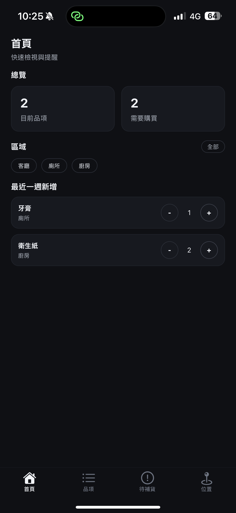
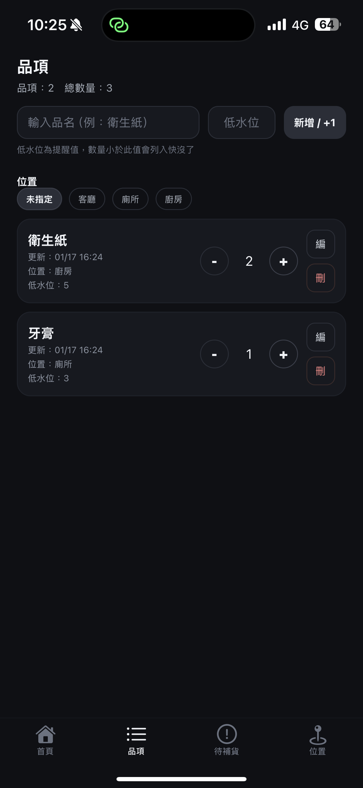
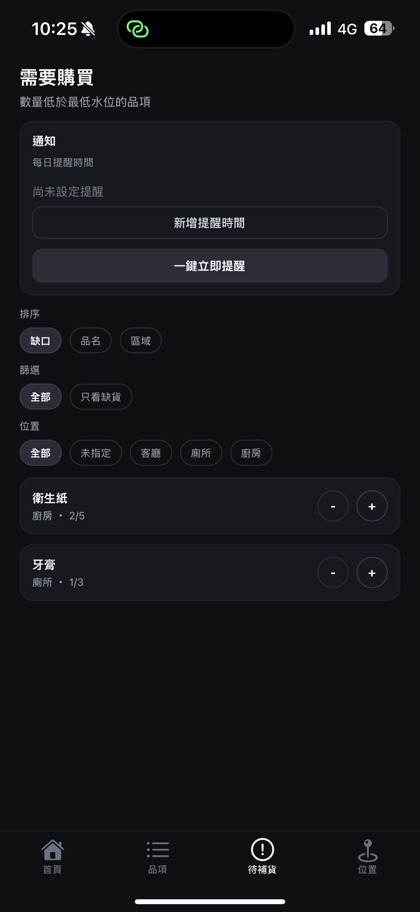
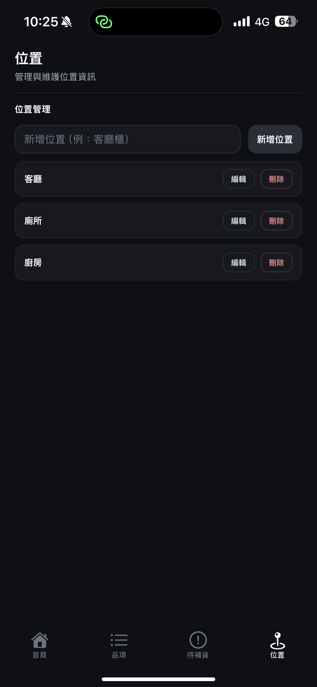

# Home Inventory / 家用庫存

用手機快速記錄家中用品庫存，搭配「低水位提醒」與本機通知，避免出門才發現缺貨。


## Features

- 品項管理：新增/刪除/編輯品項，支援數量加減與低水位 `min_qty`
- 位置管理：新增/編輯/刪除位置，品項可關聯位置
- 快沒了清單：低於 `min_qty` 自動顯示提醒，支援排序/篩選
- 首頁總覽：品項數、待補貨數、區域摘要、最近一週新增清單
- 建議品項：輸入品名時自動帶入低水位與位置
- 本機通知：每日多時段提醒 + 一鍵立即提醒
- 全資料本機化：使用 SQLite 儲存資料與設定

## Demo / Screenshots

| Home | Items | Low Stock | Locations |
| --- | --- | --- | --- |
|  |  |  |  |

## Getting Started

### Prerequisites

- Node.js 18+ (建議 LTS)
- npm 9+
- Expo CLI (使用 `npx expo`)
- iOS/Android 模擬器或實機（通知功能建議實機測試）

### Installation

```bash
git clone <your-repo-url>
cd home-inventory
npm install
```

## Usage

```bash
npm start
```

或使用下列指令：

```bash
npm run ios
npm run android
npm run web
```

### 通知功能說明

- 「待補貨」頁面可新增多個每日提醒時間
- 「一鍵立即提醒」會把目前快沒了清單推播到本機通知
- Web 不支援本機通知；iOS 通知需在實機上測試

## License

尚未指定授權（TBD）。
